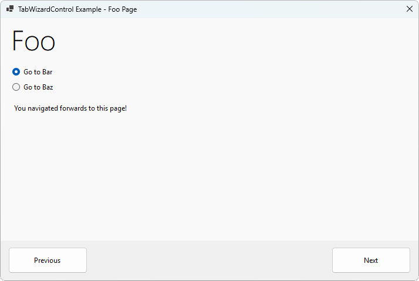

# TabWizardControl Core

A simple wizard control for Windows Forms, built off of a TabControl. This is a .NET 8+ port of the
original TabWizardControl made by Nils Måsén for .NET Framework.

<p align="center">
    <a href="Screenshots/Designer.png">
        
    </a>
    <a href="Screenshots/Program.png">
        
    </a>
</p>
<p align="center">
    <span style="display: inline-block; width: 49%;">Preview in designer</span>
    <span style="display: inline-block; width: 49%;">Control at runtime</span>
</p>

## Usage

Install the NuGet package in your project to get started. Add the TabWizardControl from the toolbox
to your form and add two buttons for next and previous. In the properties of the TabControlWizard,
set NextButton and PreviousButton to the buttons you just added.

By default, the wizard will navigate through the tabs in sequential order. To customize the order
or behaviour of the wizard, you can define a custom order of TabPages or use functions and lambda
expressions to define custom behaviour.

An example of custom behaviour implemented using lambda expressions:

```csharp
// Define a specific order to always follow.
wizard.PreviousFunction(Page1, Page3);
    
// Enable the next button if an item in a combo box is chosen.
wizard.NextFunction(Page1, () => ComboBox.SelectedIndex >= 0);

// Check the state of radio buttons to determine the next page, otherwise return null to disable
// the next button.
wizard.NextFunction(Page1, () => Button1.Checked ? Page2 : Button2.Checked ? Page3 : null);
```

A fully annotated example of defining custom behaviour is provided in the example project under
TabWizardControl.Example.

## Building

Clone the repository to your local machine and build the solution as normal. All projects currently
require .NET 8.
